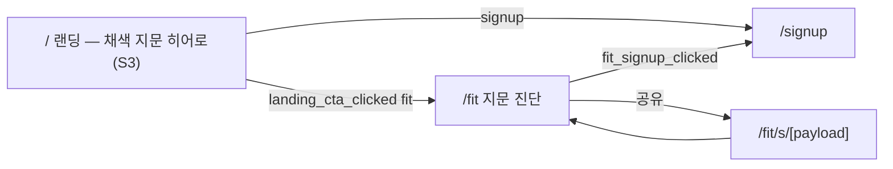
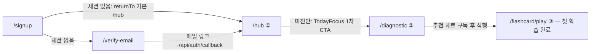
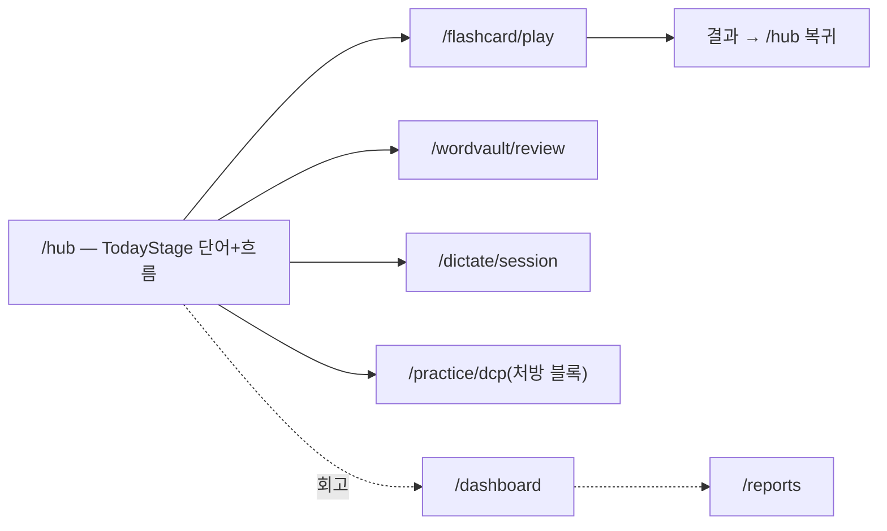
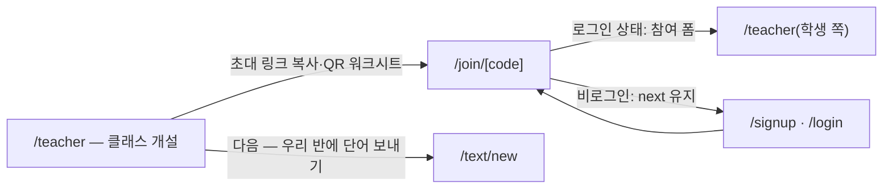

# 연결 · 핵심 여정 (Gate 1)

> 생성 2026-09-18 · Claude Code · 근거: `scripts/audit/learner-linkgraph.mjs` · `shell-reach.mjs` 재실행(메인 워크트리 읽기 전용, 결과는 세션 scratchpad — 저장소의 result.json 은 건드리지 않음) ·
> `tools/screen-graph.mjs`(page.tsx 부터의 import 트리로 파일 간선을 화면 간선으로 올림) · UX 카드의 `file:line` · Supabase `funnel_events` 집계.
>
> ⚠️ 정적 링크 분석은 템플릿 문자열 목적지(`/text/${id}`)를 못 본다. 그래서 "들어오는 길 0" 은 곧 고아가 아니다 — 카드 작성 중 grep 으로 호출부를 찾은 화면은 아래 「고아 아님」 에 따로 적었다.

## 셸 도달성 · 고아 (감사 스크립트 결과)

- 셸 메뉴로 닿지 않는 **화면 0** · 세션(허브에서 시작 — 정상) 23 · 죽은 링크 0 (`shell-reach` · `learner-linkgraph`, 2026-09-18 재실행)
- 공식 고아(학습자): `/hub-lab` · `/join/[code]`
  - `/hub-lab` — **의도된 고아**(허브 재설계 5안 비교 실험실; `link-graph-ratchet.test.ts:38` 허용 목록 · robots noindex). 단 역할 검사 없이 URL 로 열린다(카드 home/hub-lab)
  - `/join/[code]` — **고아 아님**: 교사 허브 초대 링크(`components/teacher/TeacherClient.tsx:99`) · 워크시트 QR(`ClassWorksheet.tsx:65`)
- 정적 0 이지만 실제 호출부가 있는 화면(고아 아님): `/fit/s/[payload]`(`share.ts:231`) · `/verify-email`(`(auth)/signup/page.tsx:171`) · `/text/[id]/comic`(`ModePills.tsx:131` 외 3) · `/library/scripts/[bookId]`(`ArticleCard.tsx:97`) · `/comics/adapted/[bookId]`(`library/books/page.tsx:318,361`) · `/library/textbooks/[series]`(`SeriesTabs.tsx:24,39`) · `/practice/dcp`(`lib/learner/today-blocks.ts:151`)
- **사실상 고아**: `/text/[id]/echo` — 유일한 진입이 실험실 `hub-lab/_variants/VariantA.tsx:112`, `ModePills` 에 echo 알약 없음(카드 reading/text_id_echo)

## 막다른 화면 (자기 화면에서 나가는 길 0 — 셸 제외)

| 화면 | 근거 | 판단 |
|---|---|---|
| `/comics/adapted` | screen-graph out 0 | 목록 → 상세 링크가 템플릿 문자열일 가능성(추정) — 카드 library/comics_adapted 참조 |
| `/plan` | out 0 — 실제 출구는 `activityLaunchHref`(`lib/learner/plan-activities.ts:189`) | 막다른 아님 |
| `/sitemap` | out 0 — 링크를 `item.href` 로 만든다(`page.tsx:65`) | 막다른 아님 |
| `/privacy` · `/terms` | out 0 | 법률 문서 — 정상 |
| `/text/[id]/echo` | 완료 상태 없음(`EchoMatchPlayer.tsx:528`), 빈 상태에 다음 한 걸음 없음 | **막다른 화면 · D5 위반** |
| `/text/new` | 저장 후 새 텍스트가 아니라 `/text` 로 돌아간다(`:161`) | 흐름 끊김 — 방금 만든 것을 다시 찾아야 한다 |

## 핵심 여정

### ① 첫 방문 → 증명

- 증명이 있는 것은 **`/` 하나**(서명 있음). 도구 본체 `/fit` 은 무채색 textarea + 막대 목록(평균, `@form` 선언과 불일치).
- 로그인 상태로 `/` 에 오면 미들웨어가 `/hub` 로 보낸다(`middleware.ts` — 익명 캐시 보존 목적).

### ② 가입 → 첫 학습 완료 (D7 ≤ 3 전환 — `app/__tests__/activation-path.test.ts`)

- 전환 3 — 규칙 충족. **그러나 세 화면 모두 판정 「평균」**: `/signup` 은 제출 버튼이 첫 뷰포트 밖, `/hub` 는 선언한 `@form 망각` 이 첫 시선의 단어에 렌더되지 않음, `/diagnostic` 은 남색 SaaS 히어로 카드(보라 그라디언트 코드 `DiagnosticClient.tsx:615`) + 빈 상태 D5 위반(`:763`).
- 활성화의 **길이**는 잠겨 있지만 **질**은 잠겨 있지 않다 — 이 감사의 우선순위 근거(priority.md).

### ③ 매일 복습 루프

- 모듈 세션의 세부 출구는 [cards/modules/](cards/modules/) 참조. `/dashboard` 는 셸 Growth 에서, `/reports` 는 `/dashboard` ManageSection 한 곳에서만 들어온다(`ManageSection.tsx:86`).
- 회고(L7) 두 화면 모두 판정 「평균」 — 선언한 `@form 환경 변형` 이 렌더되지 않는다(`/dashboard`).

### ④ 교사 → 학급 과제 (렌즈 6)

- `/teacher` 첫 화면은 입력 폼 2개 + 빈 박스(판정 평균). **교사가 3분 안에 학급에 던질 "증명"이 없다.**
- 결함(카드): `/login` ↔ `/signup` 전환 링크가 `next` 를 떨어뜨린다(`login/page.tsx:124` · `signup/page.tsx:201`) — 초대로 온 학생이 둘 사이를 오가면 학급 링크를 잃는다(추정, 종단 추적 안 함). 참여 실패를 삼킨다(`join/[code]/page.tsx:65-68`). `/join` 에 분석 이벤트 없음(D2).

## 수요 실측 (`funnel_events`, 2026-09-18 집계 — A5: 집계만)

| 이벤트 | 건수 | 계정 수 | 기간 |
|---|--:|--:|---|
| screen_viewed | 7,737 | 3 | 09-05 ~ 09-18 |
| catalog_viewed | 498 | 3 | 09-01 ~ 09-17 |
| csat_session_explained | 386 | 2 | 09-17 ~ 09-18 |
| fit_viewed | 64 | 1 | 09-05 ~ 09-17 |
| landing_viewed | 43 | 0(익명) | 09-04 ~ 09-18 |
| teacher_hub_view | 15 | 3 | 08-29 ~ 09-12 |
| fit_analyzed | 1 | 0 | 09-05 |

- 화면별 `screen_viewed` 상위: csat 617 · hub 400 · csat-type 337 · library-vocab 291 · library-books 223 · dictate 218 · wordvault 213.
- **결론을 내지 않는다 — 표본 부족.** 전체 이벤트가 계정 **3개**에서 나왔고(가입자 3 — AGENTS DB 통계와 같다), 게임 화면 19개가 57–60회로 거의 균일해 **자동 순회(e2e 스윕) 흔적**으로 보인다(추정). 화면 간 수요 비교의 근거로 쓰지 않는다.
- 레지스트리 드리프트 후보: `screen_viewed` 에 `csat-progress`(41) · `csat-overlay`(30) · `csat-session`(42) 가 있는데 해당 page 는 현재 코드에 없다(`/csat/progress` · `/csat/session` 은 워킹트리에서 삭제 상태, `/csat/overlay` 는 문서에만) — 과거 기록이라 정상일 수 있다(추정).

## 중복 · 통합 후보 (Gate 5 입력)

| 묶음 | 화면 | 근거 |
|---|---|---|
| 서가 4종 같은 틀 | `/library/books` · `/library/scripts` · `/comics/adapted` · `/library/vocab` | 큰 h1 + Capsule 칩 줄 + Browser 하나, `ShelfEmptyState` 공유(카드 library) |
| 내 책 3중 | `/my/books` ≡ `/text?view=books` ≡ books 「이어서 학습」 줄 | `lib/library/tabs.ts:106-113` · `lib/framework/learner-routes.ts:312` · `sidebar-config.ts:170-171` "주소만 다르다" |
| 만화 2중 | `/comics/adapted` ↔ `/library/books` 상단 만화 히어로 | 같은 `lib/comic/catalog.ts` |
| 한 책 두 입구 | `/library/books/[bookId]` ↔ `/comics/adapted/[bookId]` | 서로 링크(`comics/adapted/[bookId]/page.tsx:252`) |
| 교재 같은 화면 | `/library/textbooks` ≡ `/library/textbooks/reading` | 같은 `ShelfScreen` — 색인 목적(의도) |
| 구문 연습 2중 | `/library/textbooks/[series]/[step]/practice` ↔ `/practice/dcp` | 같은 `DcpPlayer` |
| 인증 4화면 같은 틀 | login · signup · reset-password · verify-email | 빈 바탕 한가운데 그림자 카드(판정 공개) |
| 관리자 8묶음 | 빈 KPI 4화면 · 가입 수 3중 집계 · 관문 화면 · VCB 생성 2경로 · 기출 분석 2표면 · 소스 3화면 · 미리보기 거울 · 사전 품질 3화면 | [cards/admin/_table.md](cards/admin/_table.md) (1) |
