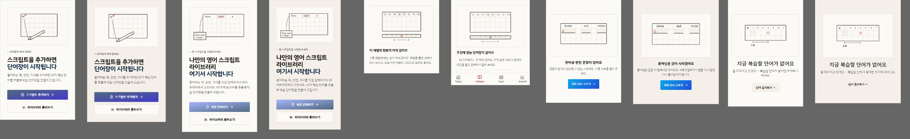

# 이미지 체계 Gate 6 — 드레인 생성 + 화면 적용 (2026-09-19)

> 지시: [image-system-brief](../design/image-system-brief.md) 4회차 · 방향 A 「원고지」(DD-30) · 골든 3점 + 이야기 선 규범 #10(DD-35) · 결정 기록 DD-36.
> 적용 순서(사용자 지시): **공개 화면·빈 상태 → 섹션 머리 → OG·브랜드**. 학습 중 화면 제외. 화면마다 캡처 → 비평(06-workflow (a)~(e)) → 가장 나쁜 것 1개 → 루프 ≤ 2, 넘으면 blocked.
> 캡처 원본(로컬, gitignore): `apps/web/test-results/design-qa/illo-20260919/` — `localhost:3000` 개발 서버 · Chromium · reduced-motion · 라이트(+다크 2점).

## 드레인 (C6)

| 단 | 명령 | 결과 |
|---|---|---|
| 1 export | `node scripts/design/assets-drain-export.mjs --out scripts/design/assets-drain/20260919` | 대상 10 · 청크 2 |
| 2 채움(에이전트) | `node docs/design/trial/20260919/fill.mjs <chunk>` | 채움 10 · 그릴 함수 없음 0 |
| 3 import | `node scripts/design/assets-drain-import.mjs scripts/design/assets-drain/20260919 --commit` | style-gate(`--ref` 골든 3 + 규범 1) **PASS 10/10** → `apps/web/src/components/illustrations/generated/*.ts` 10 |
| 재실행 | export 다시 | **대상 0 · 건너뜀 10** · import 다시 → **넣음 0 · 이미 같음 10** |
| 빈 값 거부 | 빈 svg · 짧은 svg · 청크 밖 id 를 넣은 임시 드레인 | **건너뜀 3 · 넣음 0**(파일 변화 없음) |
| 수정 재투입 | `--redo illo-15-fit-grade` (비평 루프) | 넣음 1 · version 1 → 2 |

manifest(36): **done 17 · blocked 19**(전부 note 에 사유) · target 실재 **17/17**(`scripts/design/asset-manifest-check.mjs`).

## 화면별 (C7)

(a) 익명성 · (b) 평균 회귀(이번 변경이 **늘린** 것) · (c) 골든 대조 · (d) 포트폴리오(표가 비어 있어 「기준 없음」) · (e) 규칙·접근성. 가로 넘침 · 페이지 오류는 캡처 스크립트가 함께 쟀다(전부 0).

| # | 화면 · 자리 | 뷰포트 | (a) | (b) 이번 변경 | (c) 골든 | (e) | 가장 나쁜 것 1 | 루프 | 판정 |
|---|---|---|---|---|---|---|---|---|---|
| #1 | 단어장 빈 상태(`WordVaultEmptyState`) | 390 · 1280 | 통과 — 원고지 + 연필 + 권점 | 0 | E 골든과 같은 뼈대 | decorative(옆 문장이 같은 말) | 그라디언트 CTA(`from-[--learn-fresh] to-[#4338CA]`) — **이번 변경 전부터** | 0 | 통과 · 잔여 blocked(A5 범위 밖) |
| #2 | 텍스트 허브 빈 상태 | 390 · 1280 · 390 다크 | 통과 | 0 | **골든 E 자체** | 다크 토큰 반전 ○ | 그라디언트 CTA — 이번 변경 전부터 | 0 | 통과 · 잔여 blocked(A5) |
| #3 | 서가 필터 0(`ShelfEmptyState` filtered 톤만) | 390 · 1280 | 통과 | 0 | E 골든 뼈대 | 빈·오류 톤 아이콘 그대로 | 없음 | 0 | 통과 |
| #4 | 받아쓰기 막다른 상태(`DictationEmptyState`) | 390 · 1280 | 통과 | 0 | E 골든 뼈대 | role img 유지(문장과 다른 말) | 파란 그라디언트 버튼 — 이번 변경 전부터 | 0 | 통과 · 잔여 blocked(A5) |
| #30 | 오늘 복습 없음(`WordVaultStudyClient` review) | 390 · 1280 · 390 다크 | 통과 | 0 | E 골든 뼈대 | 학습 모드 빈 상태는 권점 그대로 | 없음 | 0 | 통과 |
| #7 | `/pricing` 「읽기 전에, 이 글이 나에게 맞는지…」 머리 | 390 · 1280 | 통과 | 0 | **골든 S 자체** | 제목 → 그림 → 본문 | 없음 | 0 | 통과 |
| #8 | `/about` 「인지심리학이 입증한 7가지 원칙」 머리 | 390 · 1280 | 통과 | 0 | S 골든 · F1 밑줄 뜻 그대로 | 제목 → 그림 → 본문 | 없음 | 0 | 통과 |
| #9 | 랜딩 「다른 점」 머리 띠 | 1280(보임) · 390(숨김 확인) | 통과 | 0 | **골든 B 자체** | `hidden xl:block` — B 규격 1280+ | 없음 | 0 | 통과 |
| #14 | `/fit` 「이럴 때 씁니다」 머리 | 390 · 1280 | 통과 | 0 | S 골든 · 도장 = 액센트 한 점 | 골든 1호 판면 밖 | 없음 | 0 | 통과 |
| #15 | `/fit` 「어떻게 재나요」 머리 | 390 · 1280 | 통과 | 0 | S 골든 | — | 도장이 종이 모서리를 덮음 → 종이 아래 V6·V7 칸으로 | **1** | 통과 |
| OG | 루트 공유 카드(`app/opengraph-image.tsx` 신설) | 1200×630 | 통과 — 모눈 + 주묵 각인 | 0 | O 규격 무대 | 문구 = 랜딩 h1, 표식 2개는 공개 화면의 사실(`/fit`·`/pricing` 「가입 없이」 · `LEVEL_LABEL` 3~10) | 표식 없는 빈 발(괘선만 떠 있음) → 사실 표식 2 | **1** | 통과 |
| OG | 공용 카드(`og-card.tsx`) — 도서 OG 로 확인 | 1200×630 | 통과 | 0 | O 규격 | 색을 토큰 값으로(종이 `--bg` · 괘선 `--bd` · 각인 `--ju` · 모서리 2) | 없음 | 0 | 통과 |
| #22 | `/fit/s` 공유 카드 | 1200×630 | 통과 | 0 | O 규격 | — | 각인이 글자 없는 검은 사각 → 주묵 「V」 | **1** | 통과 |

**L3 = 0**: 적용된 삽화 10점 모두 style-gate(Tines hex 정확 · ΔE2000<2 새 색 · 금지 소재 · 서체) 0. **hex 0**: 삽화 SVG 안 hex 0(OG 는 Satori 가 CSS 변수를 못 읽어 토큰 값을 옮겨 적는 기존 방식 — `og-card.tsx` 머리 주석).
**폐기 자산 참조 0**: 빈 상태 두 곳의 장식 `Gwonjeom 64 opacity-20` 을 삽화로 바꿨다 — `Gwonjeom` 자체는 다른 곳에서 계속 쓰이므로 archive 대상 아님. 옛 파비콘은 같은 경로를 덮어 참조가 남지 않는다.
**Admin 도움말**: Admin 자산을 바꾸지 않았다 — 동기화 대상 0.

## 검수대 — 왜 `/dev/components` 인가

빈 상태 5곳은 검증 계정의 데이터(단어·자료 있음)로는 나오지 않는다. 그래서 **실제 컴포넌트를 실제 문구로** `/dev/components` 에 「0. 삽화 — 빈 상태」 절(`#illo-empty`)을 더해 렌더하고 찍었다. 받아쓰기 빈 상태는 그 파일 안의 지역 함수라 이름을 붙여 내보냈다(`DictationEmptyState`, 동작 변화 0).
**실제 경로 검증(추가, 2026-09-19)**: 아래 「실제 경로 캡처」 절 — 검수대는 그대로 유지한다.

## 실제 경로 캡처 — 「단어 0개」 계정 (DD-38)

`node --tls-max-v1.2 scripts/design/seed-empty-account.mjs` 가 `design-empty@vocaflow.local` 를 만들고(`vocabularies 0 · texts 0` 확인 — 0 이 아니면 지우지 않고 멈춘다), **실제 로그인 화면으로 로그인**해 세션을 `apps/web/playwright-auth/.auth-design-empty.json`(gitignore)에 둔다. 비밀번호는 매 실행 새로 정해 메모리에만 있다.

| # | 실제 경로 | 들어간 방법 | 삽화(`data-illo`) | 390 | 검수대와 비교 |
|---|---|---|---|---|---|
| #1 | `/wordvault` | 단어 0 | illo-01-wordbook-empty | [real-01@390.png](image-system-gate6-20260919/real-01@390.png) | 같음 |
| #2 | `/text` | 텍스트 0 · 구독 0 | illo-02-text-hub-first | [real-02@390.png](image-system-gate6-20260919/real-02@390.png) | 같음 |
| #3 | `/library/vocab?mine=1` | 「내 단어장만」 켬 → 0건 | illo-03-shelf-filter-zero | [real-03@390.png](image-system-gate6-20260919/real-03@390.png) | 삽화 같음 · 문구는 단어장 서가 쪽. 캡처 아래에 모바일 탭바가 겹침(고정 내비 — 요소 캡처의 부산물, 화면 결함 아님) |
| #4 | `/dictate/setup?custom=1` | 이 탭에 붙여넣은 글 없음 | illo-04-dictation-choose | [real-04@390.png](image-system-gate6-20260919/real-04@390.png) | 삽화 같음 · 문구 「붙여넣은 글이 사라졌어요」(다른 막다른 상태, 같은 컴포넌트) |
| #30 | `/wordvault/review` | 복습할 단어 0 | illo-30-no-review-today | [real-30@390.png](image-system-gate6-20260919/real-30@390.png) | 같음 |

**발견**: 만화 서가(`ComicsBrowser`)의 필터 0 은 **구조적으로 나오지 않는다** — 레벨 칩을 실재하는 편의 레벨로만 만든다(`bands` = 편이 있는 레벨). 그래서 #3 의 실제 경로는 단어장 서가다. 1280 캡처 5장은 `apps/web/test-results/design-qa/illo-20260919/real-*@1280-light.png`(로컬).

## 회귀

| 검사 | 결과 |
|---|---|
| `tsc --noEmit`(apps/web) | 오류 0 |
| eslint(바꾼 14파일) | 0 |
| `learning-tone` · `seo-routes` · `page-titles` · `doc-path-drift` | 통과 |
| 평균 신호 라쳇 | 2건 실패 — **감소**(grid-3eq 60→59 · ai-purple 326→318). 이번 변경은 두 신호를 늘리지 않았다. DD-33(소유 Codex) |
| 골격 선언 라쳇 | 2건 실패 — `csat/dissect`·`formulas`(미추적) · `csat/progress`·`session`(삭제) — 전부 Codex 의 미커밋 CSAT 작업(DD-20 · DD-33). 이번에 새 `page.tsx` 0 |

## 남은 것 (blocked · 사람 판단)

- 빈 상태 #1 · #2 · #4 의 **그라디언트 CTA** — 이번 변경 전부터 있던 평균 신호. Gate 6 은 자산 교체와 최소 변경만(A5)이라 두었다. 다음 화면 작업의 가장 나쁜 것 1순위.
- manifest blocked 19 — 대부분 **대응 섹션 없음**(about 에 CSAT 주제 섹션 0 · 랜딩에 서가 섹션 0). 섹션을 새로 만드는 결정은 사람 몫.
- `components/textviewer/MyTextsGrid.tsx` — import 0 고아라 **삭제**(DD-37). 그 결과 `components/textviewer/TextCard.tsx` 가 새 고아 — 지시 범위 밖이라 남겼다.
