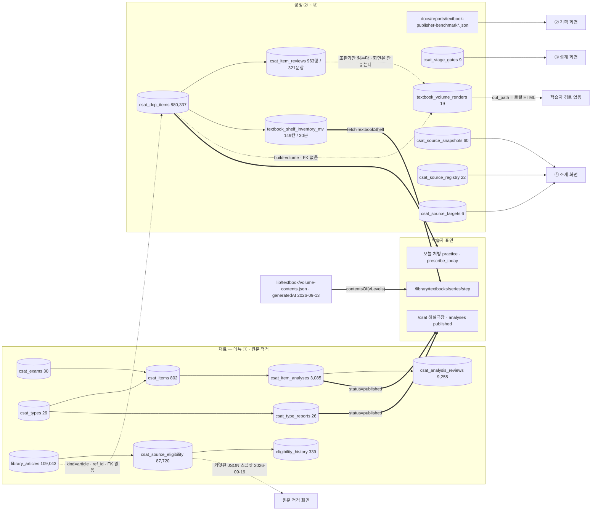

# 교재 공장 파이프라인 — 인벤토리 (Gate 0)

> 2026-09-23 · **읽기 전용.** DB 쓰기 0 · 마이그레이션 0 · 화면 코드 변경 0.
> 대상: `/admin/csat` 이하 메뉴 12항목 · 그 뒤의 드레인 스크립트 · DB 상태 필드.
> 근거는 전부 파일:줄 · SQL · 캡처다. 문서에 적힌 수치는 근거로 쓰지 않았다(AGENTS.md §하지 말 것).
> 캡처: `docs/design/shots/pipeline/*@1280.png` (11장 · gitignore · 2026-09-23 05:41~05:43 KST · 로컬 dev 서버 · `DEV_ADMIN_BYPASS`).

## 0. 이 문서가 답하는 것

메뉴 12칸이 각각 **무엇을 읽고 · 무엇으로 진행하고 · 어디에 기록을 남기는가**. Gate 1 점수표가 이 표를 근거로 채점한다.

---

## 1. 메뉴 12항목 ↔ 라우트 ↔ 컴포넌트 ↔ 데이터 ↔ 드레인 ↔ 도움말

메뉴 정의: `apps/web/src/components/admin/AdminSidebar.tsx:145-188` — 부모 1 + 자식 11 = **12칸**, 그룹 4(만들기 2 · 재료 2 · 공정 6 · 출고 1).
채점 대상 **9단계** = 재료 2(① 기출 원천 · 원문 적격) + 공정 7(②~⑧). 만들기 2(새 교재 만들기 · 카탈로그)는 공정이 아니라 **진입면**이라 단계 점수에서 빼고 §4 에서 따로 본다.

| # | 메뉴 (tag) | 그룹 | 라우트 | 주 컴포넌트 | 로더 | 읽는 테이블 · 함수 · 파일 | 드레인 | 도움말 |
|---|---|---|---|---|---|---|---|---|
| 0 | 교재 공장 | — | `/admin/csat` | `FactoryLineClient.tsx` + `FreedomPanel` + `TextbookProductionPanel` | `lib/csat/factory.ts:169-196` · `freedom-load` · `production-stages` · `shelf-query` | rpc `csat_coverage` · `csat_stage_gates` · `csat_source_snapshots` · `textbook_volume_renders` · rpc `textbook_shelf_inventory`(mv) · `csat_dcp_items`(count) | — (현황판) | `csat` · drain 있음 |
| 1 | 새 교재 만들기 | 만들기 | `/admin/csat/new` | `new/OrderWizard.tsx` | `lib/csat/order-view.ts` | `csat_exams` · `csat_items` · `csat_item_analyses` · `csat_analysis_reviews` · `csat_type_reports` · `csat_types` · `textbook_volume_renders` · item-count | 없음 | `csat-new` |
| 2 | 카탈로그 | 만들기 | `/admin/csat/catalog` | `catalog/SeriesShelf.tsx` | `lib/csat/series-view.ts` | `textbook_volume_renders(series, step)` · item-count(mv) | 없음 | `csat-catalog` |
| 3 | 기출 원천 ① | 재료 | `/admin/csat/evidence` | `evidence/EvidenceConsole.tsx` (856줄) | `evidence-operations-loader` → `evidence.ts` · `dissect-catalog` | `csat_items` · `csat_item_analyses` · `csat_analysis_reviews` · `csat_type_reports` · `csat_types` · `csat_exams` | **`csat/analysis-drain-{export,validate,import}`** | `csat-evidence` · drain · tabs 3 |
| 4 | 원문 적격 | 재료 | `/admin/csat/sources` | `sources/SourceEligibilityClient.tsx` (993줄) · `SourceWorkspace` | `source-eligibility-view` · `source-inventory-view` · `source-workspace` | **커밋된 JSON 스냅샷 6종**(`source-eligibility-snapshot` 외) + API `api/admin/csat/sources`: view `csat_source_operations` · `csat_dcp_items` · `textbook_volume_renders` | `csat/gate-article-export` → `gate-mixed-import` · `gate-drain-validate` | `csat-sources`(help/textbook.ts) · drain · tabs 3 |
| 5 | 기획 ② | 공정 | `/admin/csat/strategy` | `strategy/MarketClient.tsx` | `lib/csat/factory-views.ts:39-64` | **`docs/reports/textbook-publisher-benchmark{,-volume}.json`** + `csat_item_attempts`(count) + `textbook_volume_renders`(count) | `textbook/market-revise-export` (짝 import 없음) | `csat-strategy` · drain |
| 6 | 설계 ③ | 공정 | `/admin/csat/blueprint` | `blueprint/BlueprintClient.tsx` | `lib/csat/factory-views.ts:69-140` | `csat_stage_gates` · `countItemCells`(`csat_dcp_items`) · `SERIES_SPINE`(코드) | **없음** | `csat-blueprint`(54줄 · drain 없음) |
| 7 | 소재 ④ | 공정 | `/admin/csat/sourcing` | `sourcing/SourceClient.tsx` | `lib/csat/source-console.ts` · `kid-source-stats` | `csat_source_registry` · `csat_source_targets` · `csat_source_snapshots` · `csat_stage_gates` · `library_articles` · `library_books` | `textbook/write-drain-{export,verify,import}` · `adapt-drain-{export,import}` | `csat-sourcing` · drain · **서버액션 1개**(`sourcing/actions.ts`) |
| 8 | 집필 ⑤ | 공정 | `/admin/csat/authoring` | `authoring/AuthorClient.tsx` | `factory-line-views.loadAuthorView` | `item-count`(`csat_dcp_items` · mv) | `textbook/item-drain-{export,import,audit}` · `store-new-types` | `csat-authoring` · drain |
| 9 | 해설 ⑥ | 공정 | **없음** (`href: '/admin/csat'` · `pendingNote`) | 없음 | — | `textbook_shelf_inventory_mv.explained_count` | `textbook/explain-drain-{export,import}` · `explain-fill` | **전용 항목 없음** (부모 `csat` 안 1문단) |
| 10 | 검수 ⑦ | 공정 | `/admin/csat/review` | `review/ReviewClient.tsx` | `lib/csat/factory-line-views.ts:134-194` | **`textbook_volume_renders.colophon.review.*` 만** — `csat_item_reviews` 를 **안 읽는다** | `textbook/item-review-drain-{export,import}` | `csat-review` · drain (206줄) |
| 11 | 조판·발행 ⑧ | 출고 | `/admin/csat/press` | `press/PressClient.tsx` | `factory-line-views.loadPressView` | `textbook_volume_renders` | **없음** (`build-volume`·`render-volume` 단발 스크립트) | `csat-press`(196줄 · drain 없음) |

### 1-1. 즉시 눈에 띄는 어긋남 4

| 무엇 | 근거 |
|---|---|
| **⑦ 검수 화면이 검수 표를 안 읽는다.** 조판 시각에 얼린 `colophon.review.personaReview` 만 읽는다. `csat_item_reviews` 를 읽는 **웹 코드는 0곳**(도움말 문장·테스트 제외) | `factory-line-views.ts:157-160` · `grep -rn csat_item_reviews apps/web/src` |
| **원문 적격이 DB 가 아니라 커밋된 JSON 을 읽는다.** 스냅샷 `measuredAt 2026-09-19T02:31Z` · 87,716행, DB `max(measured_at) 2026-09-20T00:38Z` · **87,720행** | `source-eligibility-view.ts:34-39` · SQL |
| **② 기획이 DB 가 아니라 `docs/reports/*.json` 을 읽는다.** 화면이 스스로 "리포트 2026-09-17 생성 · 5.4일 전 — 사람이 `market-benchmark` 를 돌려야 갱신된다" 고 적는다 | `factory-bench.ts:186-189` · 캡처 `00-dashboard` |
| **⑥ 해설에 화면이 없다** — 메뉴 항목은 있는데 `href` 가 부모를 가리키고 「준비 중」 배지가 붙는다 | `AdminSidebar.tsx:173-180` · 전 캡처의 좌측 레일 |

---

## 2. 데이터 의존 그래프

FK 는 `pg_constraint` 실측(관련 14건), 나머지 간선은 코드·SQL 에서 추출했다.
**점선 = FK 가 없는 간선**(문자열·약속으로만 이어진 곳) · **굵은 화살표 = 학습자 도달 경로**.

### 2-1. 그래프가 말하는 것

1. **출고물이 학습자에게 안 간다.** `textbook_volume_renders` 를 읽는 곳은 Admin 5모듈(`factory.ts` · `factory-views` · `factory-line-views` · `series-view` · `order-view`)과 `api/admin/csat/sources` 뿐이다. 학습자 쪽 grep = **0**. 조판 산출물은 `out_path` 의 로컬 HTML 파일이다.
2. **학습자 매대는 조판이 아니라 재고에서 그려진다.** `/library/textbooks/[series]/[step]` 은 `fetchTextbookShelf`(→ mv → `csat_dcp_items`)와 `volume-contents.json` 스냅샷을 읽는다(`page.tsx:129-160`). **검수·조판 통과 여부를 묻지 않는다.**
3. **메뉴 순서와 데이터 흐름이 한 군데에서 어긋난다.** 메뉴는 ① 기출 원천 → 원문 적격 → ② 기획 순인데, ② 가 읽는 벤치마크 JSON 은 앞의 둘 중 어느 것도 입력으로 쓰지 않는다(시중 교재 코퍼스가 입력이다). ② 는 라인 위가 아니라 **옆에 붙은 축**이다.

---

## 3. 단계별 상태 필드 · 사유 필드 · 승인 상태 (DB 실측 2026-09-23)

`information_schema.columns` 를 `approv|review|publish|status|state|reason|blocked|verdict|locked|flag` 로 훑었다.

| 단계 | 산출 표 | 항목 수 | 상태 필드 | 사유 필드 | 승인 상태 | status 분포 (실측) |
|---|---|---|---|---|---|---|
| ① 기출 원천 | `csat_item_analyses` | 3,085행 / 802문항 | `status` text | 없음 (`answer_unknown`·`body_recovered` 불리언뿐) | **없음** | `published` **3,085 (100%)** — 다른 값이 존재한 적 없다 |
| ① 검수 | `csat_analysis_reviews` | 9,255 | `verdict` | `findings`·`checked` jsonb | 없음 | `pass` **9,255 (100%)** — `fail`·`revise` **0건** |
| 원문 적격 | `csat_source_eligibility` | 87,720 | `result->>'grade'` | `result` 안 `reasons`·`blockers`·`blockedBy`·`recoverable` + `quality_flags[]` | 없음 | unjudged 48,488 · blocked 14,649 · excerpt-blind 10,861 · **usable 9,107** · excerpt 4,615 |
| ② 기획 | (표 없음 — 파일) | — | **없음** | 없음 | 없음 | — |
| ③ 설계 | `csat_stage_gates` | 9 | `is_locked` bool | `note` | 없음 | `is_locked=true` **0건** (9행 전부 false) |
| ④ 소재 | `csat_source_registry` / `_targets` / `_snapshots` | 22 / 6 / 60 | `active` bool | `note` | 없음 | active 18/22 · 6/6 |
| ⑤ 집필 | `csat_dcp_items` | **880,337** | **없음** | **없음** | **없음** | — (문항에 상태 개념이 아예 없다) |
| ⑥ 해설 | `csat_dcp_items.answer_key.explanation_ko` | 875,618 / 880,337 | 없음 (존재 유무) | 없음 | 없음 | 보유 **99.46%** · 빈 칸 0/149 |
| ⑦ 검수 | `csat_item_reviews` | 963행 / **321문항** | `verdict` | `findings`·`checked` jsonb · `reviewed_digest` | 없음 | pass 303 · **revise 501** · **fail 159** |
| ⑧ 조판·발행 | `textbook_volume_renders` | 19 | **없음** (`auto_passed/auto_total` · `failed_checks[]` 뿐) | `failed_checks[]` — 전 19행 **NULL** | **없음** | 전 19행 `auto_passed = auto_total = 10` · `brand_fingerprint` 전부 `8ded9c49` |

### 3-1. 실측 결론 3

- **승인(approval) 컬럼은 파이프라인 전체에 0개.** `approved_by`·`approved_at`·`approver` 류가 `csat_*`·`textbook_*` 어디에도 없다. 승인은 화면 밖 사람의 판단에만 있고 기록되지 않는다.
- **상태 필드가 있어도 값이 하나뿐인 곳이 둘.** `csat_item_analyses.status` = 100% `published`, `csat_analysis_reviews.verdict` = 100% `pass`. 상태 축이 **판정을 하지 않는다** — 같은 3인 검수인데 ⑦ 의 `csat_item_reviews` 만 pass/revise/fail 이 실제로 갈린다.
- **가장 큰 표(`csat_dcp_items` 880,337행)에 상태도 사유도 없다.** 문항이 「쓸 수 있는가 · 왜 못 쓰는가」는 화면이 매번 다시 계산하고, 그 계산 결과는 어디에도 안 남는다.

---

## 4. 드레인 계약 — 단계별 유무와 3단 구조 충족

AGENTS.md §🤖 의 3단(`export` → 에이전트 → `import --commit`) 기준. 「건너뛴 수 출력」은 스크립트가 재실행 시 완료분을 세어 출력하는지로 봤다.

| 단계 | export | 에이전트 몫 | import `--commit` | 검증기 | 건너뛴 수 출력 | 서브에이전트 |
|---|---|---|---|---|---|---|
| ① 기출 원천 | `csat/analysis-drain-export.mjs` | O | `analysis-drain-import.mjs` | `analysis-drain-validate.mjs` | O | **`csat-item-analyst`** |
| 원문 적격 | `csat/gate-article-export.mjs` | O | `gate-mixed-import.mjs` | `gate-drain-validate.mjs` | O | 없음 |
| ② 기획 | `textbook/market-revise-export.mjs` | O | **없음** (export 가 `--commit` 을 직접 가짐) | 없음 | X | 없음 |
| ③ 설계 | **없음** | — | **없음** | `verify-blueprint*.mjs` 3종 | — | 없음 |
| ④ 소재 | `textbook/write-drain-export.mjs` · `adapt-drain-export.mjs` | O | `write-drain-import` · `adapt-drain-import` | `write-drain-verify.mjs` | O | 없음 |
| ⑤ 집필 | `textbook/item-drain-export.mjs` | O | `item-drain-import.mjs` | `item-drain-audit.mjs` | O | 없음 |
| ⑥ 해설 | `textbook/explain-drain-export.mjs` | O | `explain-drain-import.mjs` | 없음 (`explain-fill` 선행) | O | 없음 |
| ⑦ 검수 | `textbook/item-review-drain-export.mjs` | O | `item-review-drain-import.mjs` | 없음 | O | 없음 |
| ⑧ 조판·발행 | **없음** | — | **없음** | `proofread-report` · `item-health-report` | — | 없음 |

- 관련 스크립트 총수: `scripts/csat/*.mjs` **170** · `scripts/textbook/*.mjs` **106**. 그중 드레인 3단을 이루는 것은 **위 14개**뿐이다.
- **화면에서 드레인을 실행할 수 있는 곳은 0곳.** 명령은 전부 복사해 터미널에 붙이는 문자열이다(복사 버튼은 현황판에만 — 캡처 `00-dashboard`). 유일한 서버 액션은 ④ 소재의 「지금 다시 잰다」(`csat_source_snapshot_take` RPC)로 **드레인이 아니라 계측 재실행**이다.
- 비교 대상: 같은 Admin 안의 CCP 는 `admin/comic/[bookId]/drain/DrainConsole.tsx` 가 실행 기록(`run.status` · `panels_done/total`)과 **발행 차단 사유 목록**을 화면에 낸다. 교재 공장에는 대응물이 없다.

---

## 5. 화면 캡처 — 현 상태 (1280 · 2026-09-23)

| 파일 | 라우트 | 응답 | 문서 높이 | 가로 넘침 | 콘솔 에러 |
|---|---|---|---|---|---|
| `00-dashboard@1280.png` | `/admin/csat` | 200 | 1,707 | 0 | 0 |
| `01-new@1280.png` | `/admin/csat/new` | 200 | 900 | 0 | 0 |
| `02-catalog@1280.png` | `/admin/csat/catalog` | 200 | 900 | 0 | 0 |
| `03-evidence@1280.png` | `/admin/csat/evidence` | 200 | 1,319 | 0 | 0 |
| `04-sources@1280.png` | `/admin/csat/sources` | 200 | 2,908 | 0 | 0 |
| `05-strategy@1280.png` | `/admin/csat/strategy` | 200 | 2,163 | 0 | 0 |
| `06-blueprint@1280.png` | `/admin/csat/blueprint` | 200 | 1,994 | 0 | 0 |
| `07-sourcing@1280.png` | `/admin/csat/sourcing` | 200 | 900 | 0 | 0 |
| `08-authoring@1280.png` | `/admin/csat/authoring` | 200 | 1,728 | 0 | 0 |
| `09-review@1280.png` | `/admin/csat/review` | 200 | 1,671 | 0 | 12 |
| `10-press@1280.png` | `/admin/csat/press` | 200 | 1,734 | 0 | 12 |

⑥ 해설은 전용 라우트가 없어 캡처가 없다 — 그 자체가 인벤토리 항목이다.

### 5-1. 캡처에서만 드러난 결함 1건

**④ 소재 화면이 `[object Object]` 를 인쇄한다.** 「초·중 원문 재고」 절이 `Object.entries(kidSource.inventory)` 를 그대로 펴서 영어 키(`bands`·`adapted`·`total`·`pct`)와 `[object Object]` **6개**를 낸다 — `sourcing/SourceClient.tsx:296-303` 의 `String(v)` 분기. 캡처 `07-sourcing@1280.png`.

---

## 6. 읽기 전용 확인

- **DB 쓰기 0** — 이 게이트에서 실행한 SQL 은 전부 `select`. `apply_migration` 호출 0.
- **화면 코드 변경 0** — `apps/web/**` 에 이 작업이 만든 변경 없음(작업 시작 시점의 타 세션 변경은 손대지 않았다).
- 새로 만든 파일: 이 문서 · `docs/reports/pipeline-scorecard.md` · `docs/reports/pipeline-redesign.md` · `docs/design/shots/pipeline/*`(gitignore 대상 경로).
